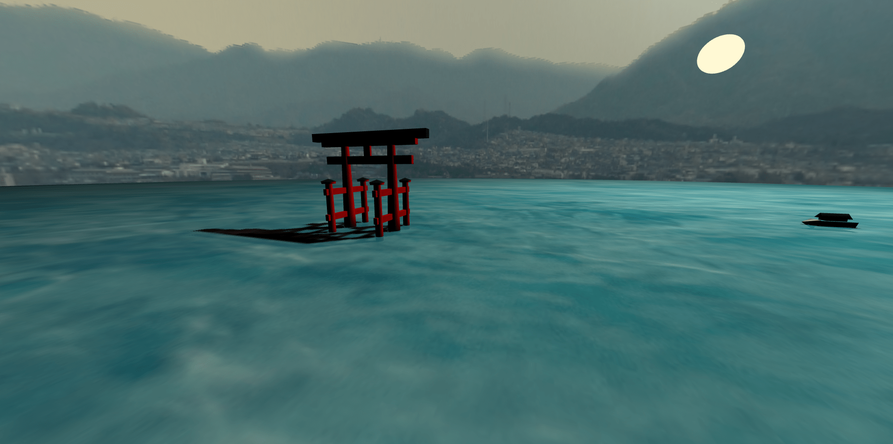

# Itsukushima Shrine WebGL Scene

This was a project for the Computer Graphics course.

The scene consists of the _torii_ gate of Itsukushima Shrine, in Hiroshima, Japan.  
It was made with WebGL, using the [Three.js](https://threejs.org/) library.

You can view the scene [here](https://marianoalipi.github.io/webgl-scene).

Mariano García Alipi  
A00822247

## Credits

- This project uses the sound "[_20100803.surf.seagulls.wav_](https://freesound.org/people/dobroide/sounds/102852/)" from Freesound, by user _dobroide_, licensed under CCBYNC 3.0.
- This project uses the image "[_Panorama of the floating torii gate at Itsukushima Shrine_](https://commons.wikimedia.org/wiki/File:Panorama_of_the_floating_torii_gate_at_Itsukushima_Shrine.jpg)" from Wikimedia Commons, by user _Fattony12000_, licensed under CC BY-SA 4.0. It was modified to obtain a seamless panoramic image.
- All other textures were obtained from [Free Stock Textures](https://freestocktextures.com).
